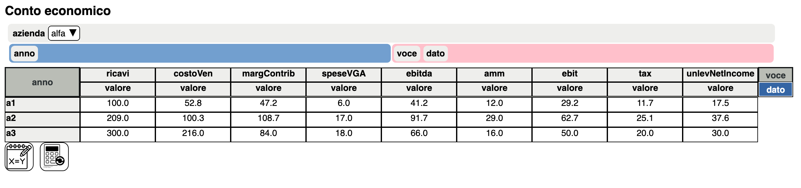
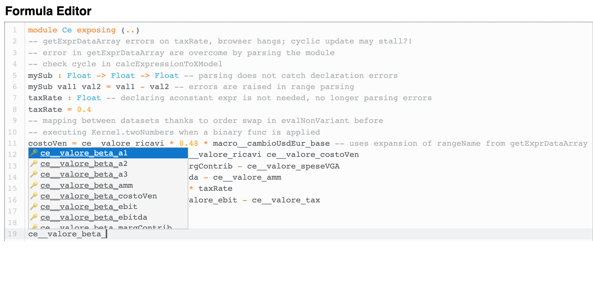
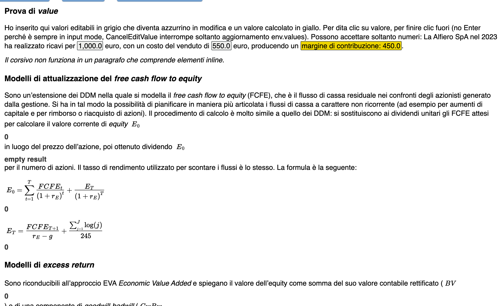

# elm-foldbook

**A multidimensional spreadsheet with mathematical documents, written in Elm, for teaching and
research in corporate finance.**

Luca Erzegovesi, Department of Economics and Management, University of Trento.
Developed June – December 2024 · reference version **0.7** (16 December 2024) · public releases
**0.7.1–0.7.2** (2026, packaging and documentation only) · BSD 3-Clause.

[](https://doi.org/10.5281/zenodo.23056100)
· Software Heritage (tag v0.7):
[swh:1:rel:1a45a295993b1acee16b332b8dfa3aea2ad3d300](https://archive.softwareheritage.org/swh:1:rel:1a45a295993b1acee16b332b8dfa3aea2ad3d300)

> **Research prototype.** elm-foldbook was the pilot of **Impromptu**, the multidimensional
> modelling environment I develop today. Impromptu's Elm front end grew out of the elm-foldbook
> grid, pivot trays, views and data types, and its calculation engine moved from the browser
> to a Julia server. Impromptu is not public yet; I write about it on
> [The Workbench](https://theworkbench.lerzegov.org), in particular in
> [Impromptu under the hood](https://theworkbench.lerzegov.org/posts/impromptu/), and on
> [YouTube](https://www.youtube.com/@TheWorkbench.lerzegov). elm-foldbook is published as the
> runnable, documented record of that first stage. It is not maintained.


## Idea

Financial models usually live in cell-based spreadsheets: the same formula is copied across
hundreds of cells, the model's structure (companies, years, line items, scenarios) stays
implicit, and the textbook formula the model implements sits in another document.
elm-foldbook explores an alternative in the tradition of Lotus Improv and Quantrix Modeler.

- **Datasets with named dimensions.** A model is a set of datasets, such as an income statement
  indexed by *company × line item × year*. Dimensions are shared across the model, and values
  are stored as dense labelled arrays.
- **Array-level formulas written in Elm.** One line computes a whole slice:
  `ce__valore_ebitda = ce__valore_margContrib - ce__valore_speseVGA`. The formulas of a
  dataset form an Elm module, evaluated by an Elm interpreter extended with multidimensional
  values, broadcasting and alignment by coordinates.
- **Documents with live models.** [elm-markup](https://github.com/mdgriffith/elm-markup)
  documents mix prose, LaTeX equations edited with [MathLive](https://cortexjs.io/mathlive/)
  and fully interactive sheets.

Drag dimensions between the page, row and column trays to look at the same dataset from
another angle:



The formula editor (CodeMirror 6) completes range names as you type:



## Run it

The compiled application is in `public/`. Any static web server will do:

```sh
git clone https://github.com/lerzegov/elm-foldbook.git
cd elm-foldbook/public
python3 -m http.server 8000      # then open http://localhost:8000/
```

Tested with Chromium (Chrome). The committed `public/ui.js` is the elm-watch development
build of 16 December 2024, so the console reports a harmless failed WebSocket connection to
the elm-watch hot-reload server.

## Examples

The start page, `public/articles/Mathlive.emu`, holds a small planning model (`finPlan`):

- **Az**: company master data;
- **Ce**: income statement of two companies over three years, from revenue to unlevered net
  income. Cost of sales uses the USD/EUR rate from Macro;
- **Macro**: inflation and exchange-rate scenarios (base, worst, best, forecast).

Things to try:

- Double-click a revenue cell, change it and press Enter. The whole chain is recalculated.
- Drag `azienda` to the grey page tray and swap `anno` and `voce`.
- Open the formula editor (the `X=Y` button) under a sheet.
- Scroll down to the equations: bond pricing with a user-defined function `Psum`.

`public/articles/Equations.emu` is a teaching-style document in Italian on equity valuation.
It covers FCFE discounting with a Gordon terminal value and a two-stage excess-return (EVA)
model, with editable values inside the text. The start document is fixed in the code, so to
open this one either:
- copy it over `public/articles/Mathlive.emu` in your clone; or
- paste its text into the editor opened by **View Source**.



The model itself is defined in code (`vendor/elm-interpreter-fork/src/XModel.elm`, at the
end of the file).

## Build from source

You need [Elm 0.19.1](https://guide.elm-lang.org/install/elm.html). Node.js is needed only for
the MathLive bundle.

```sh
elm make src/Main.elm --output public/ui.js      # add --optimize for a production build

npm ci && npx rollup -c                          # optional: MathLive web component
cp dist/mathlive-bundle.js public/
```

The calculation engine is included in `vendor/`, so no other checkout is needed. The rebuilt
`mathlive-bundle.js` is byte-identical to the committed one.

## How it works

| Part | Where | What it does |
|---|---|---|
| Data model | `vendor/…/XModel.elm`, `TypesXModel.elm` | shared dimensions, datasets, flat row-major arrays, `loc`/`iloc` selection, structural edits, alignment by coordinates |
| Engine | `vendor/…/Eval/*`, `Kernel.elm` | [elm-interpreter](https://github.com/miniBill/elm-interpreter) by Leonardo Taglialegne, extended so that unknown names resolve to array slices and arithmetic broadcasts over arrays |
| Recalculation | `src/CalcEngine.elm`, `src/Main.elm` | one interpreter environment per dataset; formulas run in declaration order; datasets can declare the datasets that depend on them |
| Grid | `src/SpreadsheetUI.elm`, `XView.elm`, `DnDTray.elm` | hierarchical headers, page/row/column trays, cell and structure editing |
| Documents | `src/MarkupFoldbook.elm`, `srcjs/` | elm-markup blocks (`Sheet`, `Equation`, text), MathLive with the Cortex Compute Engine, CodeMirror editors through ports |

Known limitations:
- there is no dependency graph and no detection of circular references;
- models cannot be saved as files;
- equations and sheets do not share variables;
- the interpreter in the browser limits performance;
- some demo examples are experimental and return wrong values.

Impromptu addresses all of these.

## Repository notes

- `src/`, `srcjs/` and `public/` are unchanged from v0.7. `srcjs/codemirror/*.recovered.js`
  holds the project-specific CodeMirror code, copied verbatim from the v0.7 bundle.
- `vendor/elm-interpreter-fork/` is the engine. It is developed in the public fork
  [lerzegov/elm-interpreter-fork](https://github.com/lerzegov/elm-interpreter-fork) (public
  since July 2024), reconstructed here to its exact 16 December 2024 state (see
  `vendor/README.md`).
- The git history starts with the history of miniBill/elm-interpreter (2023–2024).
  elm-foldbook branched from it on 19 June 2024.

| Tag | Date | Milestone |
|---|---|---|
| v0.0–v0.3 | Jun – Jul 2024 | range names, formula parsing, CodeMirror, recalculation across datasets |
| 0.4–0.6 | Jul – Aug 2024 | engine moved to the fork; elm-markup documents; MathLive |
| **v0.7** | **16 Dec 2024** | reworked grid structure handling (reference version) |
| v0.7.1 | 2026 | public release: engine vendored, licenses, documentation |
| v0.7.2 | 2026 | updated README; Zenodo metadata |

## License and credits

BSD 3-Clause (see [LICENSE](LICENSE)). Built on:
- [elm-interpreter](https://github.com/miniBill/elm-interpreter) by **Leonardo Taglialegne**;
- [elm-markup](https://github.com/mdgriffith/elm-markup) and elm-ui by Matthew Griffith;
- [dnd-list](https://github.com/annaghi/dnd-list) by annaghi;
- [MathLive and the Compute Engine](https://cortexjs.io/) by Arno Gourdol;
- [CodeMirror](https://codemirror.net/) by Marijn Haverbeke.

The hierarchical headers were first prototyped on
[elm-pivot-table](https://github.com/integral424/elm-pivot-table). See
[THIRD_PARTY_NOTICES.md](THIRD_PARTY_NOTICES.md) for all components. To cite this software,
see [CITATION.cff](CITATION.cff):

> Erzegovesi, L. (2026). *elm-foldbook: a multidimensional spreadsheet prototype with mathematical
> documents for teaching and research in corporate finance* (version 0.7; developed June–December
> 2024). Zenodo. https://doi.org/10.5281/zenodo.23056100

The calculation engine, [elm-interpreter-fork](https://github.com/lerzegov/elm-interpreter-fork)
(public since July 2024), is archived separately:
[10.5281/zenodo.23056240](https://doi.org/10.5281/zenodo.23056240).
