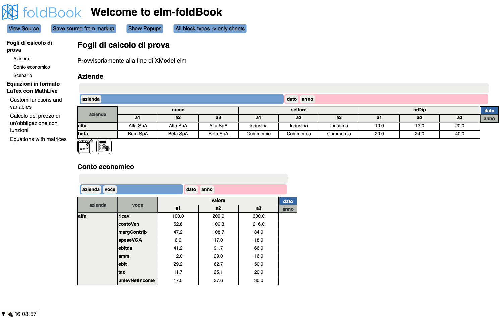
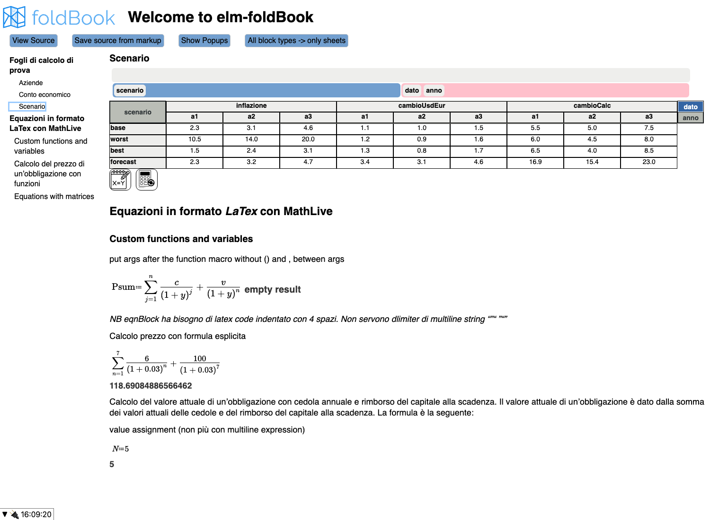

# elm-foldbook

**A multidimensional spreadsheet with mathematical documents, built in Elm for teaching and
research in corporate finance.**

Author: Luca Erzegovesi, Department of Economics and Management, University of Trento.

| | |
|---|---|
| Development | June – December 2024 |
| Reference version | **0.7**, tag `v0.7`, 16 December 2024 |
| This release | **0.7.1** (2026): packaging and documentation only, application code unchanged |
| Made public | 2026 |
| License | BSD 3-Clause |

> **Research prototype.** elm-foldbook was the pilot of **Impromptu**, the multidimensional
> modelling environment I develop today. Impromptu's Elm front end started from the
> elm-foldbook grid, pivot trays, views and data types. The calculation engine was moved from
> the browser to a server written in Julia. Impromptu is not public yet; I describe it on
> [The Workbench](https://theworkbench.lerzegov.org), in particular in
> [Impromptu under the hood](https://theworkbench.lerzegov.org/posts/impromptu/), and on the
> [YouTube channel](https://www.youtube.com/@TheWorkbench.lerzegov).
> elm-foldbook is published as the documented, runnable record of that first stage. It is not
> maintained software.



## What it does

Financial models are usually built in cell-based spreadsheets. The same formula is copied
across hundreds of cells, and the structure of the model (companies, years, line items,
scenarios) stays implicit. The textbook formula that the model implements lives in a
different document. elm-foldbook explores an alternative in the tradition of Lotus Improv and
Quantrix Modeler, with three ideas:

1. **Datasets with named dimensions.** A model is a set of datasets, such as an income
   statement indexed by *company × year × line item*. Dimensions are shared across the
   model. Values are stored as dense arrays, like labelled arrays in xarray.
2. **Array-level formulas.** A formula is written once for a whole slice of the dataset:
   `ce__valore_ebitda = ce__valore_margContrib - ce__valore_speseVGA`.
   It is evaluated by an Elm interpreter extended with multidimensional values. Scalars
   broadcast over arrays, and arrays with different dimensions are aligned by coordinates.
3. **Documents that contain live models.** Documents written in
   [elm-markup](https://github.com/mdgriffith/elm-markup) mix text, LaTeX equations edited
   with [MathLive](https://cortexjs.io/mathlive/) and fully interactive sheets. An equation
   can define a function and evaluate it, for example the price of a bond.

Features of version 0.7:

- a pivot-style grid with hierarchical row and column headers;
- drag and drop of dimensions between the page, row and column trays;
- structural editing: add, rename and delete dimensions, coordinates and variables;
- a formula editor (CodeMirror 6) that completes coordinate names as you type;
- recalculation of formulas within a dataset, and propagation to dependent datasets;
- financial functions (bond price and yield, NPV, IRR, Black–Scholes, Garman–Kohlhagen);
- MathLive equations evaluated by the Cortex Compute Engine, with finance macros
  (`\PV`, `\ytm`, `\CPN`, `\FV`) and Italian speech output;
- documents edited block by block or as source, and saved to local files.



## Run it locally

The repository contains the compiled application in `public/`. You only need a static web
server. No Elm or Node installation is required.

```sh
git clone https://github.com/lerzegov/elm-foldbook.git
cd elm-foldbook/public
python3 -m http.server 8000
```

Then open <http://localhost:8000/>. Tested with Chromium (Chrome); other recent browsers
should work. Saving documents uses the File System Access API where available.

`public/ui.js` is the build committed on 16 December 2024. It is an elm-watch development
build, so the browser console shows a harmless failed WebSocket connection to the elm-watch
hot-reload server.

## Build from source

Requirements: [Elm 0.19.1](https://guide.elm-lang.org/install/elm.html). Node.js (tested with v22) is
needed only to rebuild the MathLive bundle.

```sh
# Elm application (calculation engine included, see vendor/)
elm make src/Main.elm --output public/ui.js
# optimized build instead:
# elm make src/Main.elm --optimize --output public/ui.js

# MathLive web component (optional: the result equals the committed bundle)
npm ci
npx rollup -c                 # writes dist/mathlive-bundle.js, fonts, sounds, mathmaps
cp dist/mathlive-bundle.js public/
```

Both builds were verified from a clean clone on 29 September 2026. The rebuilt
`mathlive-bundle.js` is byte-identical to the committed one, and the rebuilt Elm application
behaves like the 2024 build.

`public/codemirror-bundle.js` is a prebuilt CodeMirror 6 bundle. Its project-specific parts
are in `srcjs/codemirror/` (see [Repository layout](#repository-layout)).

## Architecture

```
public/index.html ─ Elm.Main + ports ─┬─ codemirror-bundle.js (formula and markup editors)
                                      └─ mathlive-bundle.js   (math editor, Compute Engine)
src/  (Elm application)
  Main ─ Routes ─ Home
  MarkupFoldbook ── elm-markup document: text, Equation and Sheet blocks, inline values
  DatasetPage ──── SpreadsheetUI (grid) ─ XView (views) ─ DnDTray (pivot trays)
  CalcEngine ───── builds one interpreter environment per dataset, evaluates formulas,
                   writes results back, queues dependent datasets for recalculation
vendor/elm-interpreter-fork/src  (calculation engine)
  XModel, TypesXModel ─ multidimensional model: dims, datasets, DataArrays, loc/iloc,
                        range names, structural edits, array alignment
  Eval/*, Kernel ────── Elm interpreter (L. Taglialegne), extended with DataArray values
                        and broadcasting arithmetic
  Financial, XParser, FormulaParser
```

- **Data model.** An `XModel` holds shared dimensions (`Dims`) and datasets. A `Dataset`
  selects an ordered list of dimensions and holds `DataArray`s: flat numeric and text arrays
  in row-major order. A dataset's variables act as an extra pseudo-dimension, so they can be
  moved between trays like any other dimension.
- **Formulas.** The formulas of a dataset form one Elm module. Top-level names are *range
  names* of the form `dataset__variable_coord_coord`. Coordinates are resolved to their
  dimensions automatically, and are qualified as `dimDOTcoord` when ambiguous. When the
  interpreter meets an unknown name, it resolves it as a range name and loads the
  corresponding array slice lazily.
- **Recalculation.** Formulas are evaluated in declaration order. A dataset can declare the
  datasets that depend on it (`dependentDatasetRefs`), and those are recalculated after it.
- **Documents.** `.emu` files in `public/articles/` are loaded at start-up.
  `Mathlive.emu` is the default document.

## Repository layout

| Path | Content | Origin |
|---|---|---|
| `src/` | Elm application (≈ 11,800 lines) | L. Erzegovesi, 2024 |
| `srcjs/` | MathLive web component and configuration (TypeScript) | L. Erzegovesi, 2024 |
| `srcjs/codemirror/*.recovered.js` | CodeMirror custom elements and elm-markup language, recovered verbatim from the v0.7 bundle | L. Erzegovesi, 2024 |
| `vendor/elm-interpreter-fork/` | Calculation engine: elm-interpreter plus the XModel extensions (≈ 7,100 of its ≈ 11,900 source lines are by L. Erzegovesi) | L. Taglialegne 2023–24; L. Erzegovesi 2024 |
| `public/` | Compiled application, bundles, fonts, example documents | build of 16 Dec 2024 |
| `tests/` | Tests of the original interpreter (not used by the app) | L. Taglialegne |
| `docs/screenshots/` | Screenshots of version 0.7 | 2026 |

The git history also contains the history of
[miniBill/elm-interpreter](https://github.com/miniBill/elm-interpreter), from May 2023 to
February 2024. elm-foldbook started from that code on 19 June 2024.

`vendor/README.md` explains how the engine sources were reconstructed to match exactly the
16 December 2024 build, and how that was verified.

## Limitations

This is a prototype. Known limitations of version 0.7:

- there is no dependency graph between formulas: evaluation follows declaration order, and
  circular references are not detected;
- models are defined in code (`XModel.elm`); there is no file format to save them;
- LaTeX equations and sheets live in the same document but do not yet share variables:
  equations are evaluated by the Compute Engine, sheets by the Elm interpreter;
- performance is limited by interpreting Elm in the browser;
- some examples in the demo documents are experimental and return incorrect values.

Impromptu was designed to remove these limits. It has:

- a Julia calculation server with a topologically sorted, cycle-aware recalculation;
- an array-level formula language compiled to Julia;
- persistent models;
- Markdown reports that interpolate model expressions;
- charts and multi-user editing.

## History

| Tag | Date | Milestone |
|---|---|---|
| v0.0–v0.1 | 19 Jun 2024 | Project created from elm-interpreter; foldBook home page |
| v0.2 | 26 Jun 2024 | Range names, formula parsing, editor hints |
| v0.3 | 1 Jul 2024 | CodeMirror 6; recalculation across datasets |
| 0.4–0.5 | 29 Jul 2024 | Engine and XModel moved to [elm-interpreter-fork](https://github.com/lerzegov/elm-interpreter-fork) (public) |
| 0.6 | 12 Aug 2024 | elm-markup documents with sheet blocks; MathLive |
| **v0.7** | **16 Dec 2024** | Reworked grid structure handling (reference version) |
| v0.7.1 | 2026 | Public release: engine included in `vendor/`, licenses, documentation |

## License and credits

elm-foldbook is released under the [BSD 3-Clause License](LICENSE).

- The calculation engine is built on [elm-interpreter](https://github.com/miniBill/elm-interpreter)
  by **Leonardo Taglialegne** (BSD-3-Clause).
- Documents use [elm-markup](https://github.com/mdgriffith/elm-markup) by Matthew Griffith,
  through the fork [lerzegov/elm-markup-fork](https://package.elm-lang.org/packages/lerzegov/elm-markup-fork/latest/).
- The hierarchical headers were first prototyped on
  [elm-pivot-table](https://github.com/integral424/elm-pivot-table) by integral424.
- Math editing relies on [MathLive and the Cortex Compute Engine](https://cortexjs.io/) by
  Arno Gourdol. Code editing relies on [CodeMirror](https://codemirror.net/) by Marijn Haverbeke.

See [THIRD_PARTY_NOTICES.md](THIRD_PARTY_NOTICES.md) for all components and licenses.
To cite this software, see [CITATION.cff](CITATION.cff).
